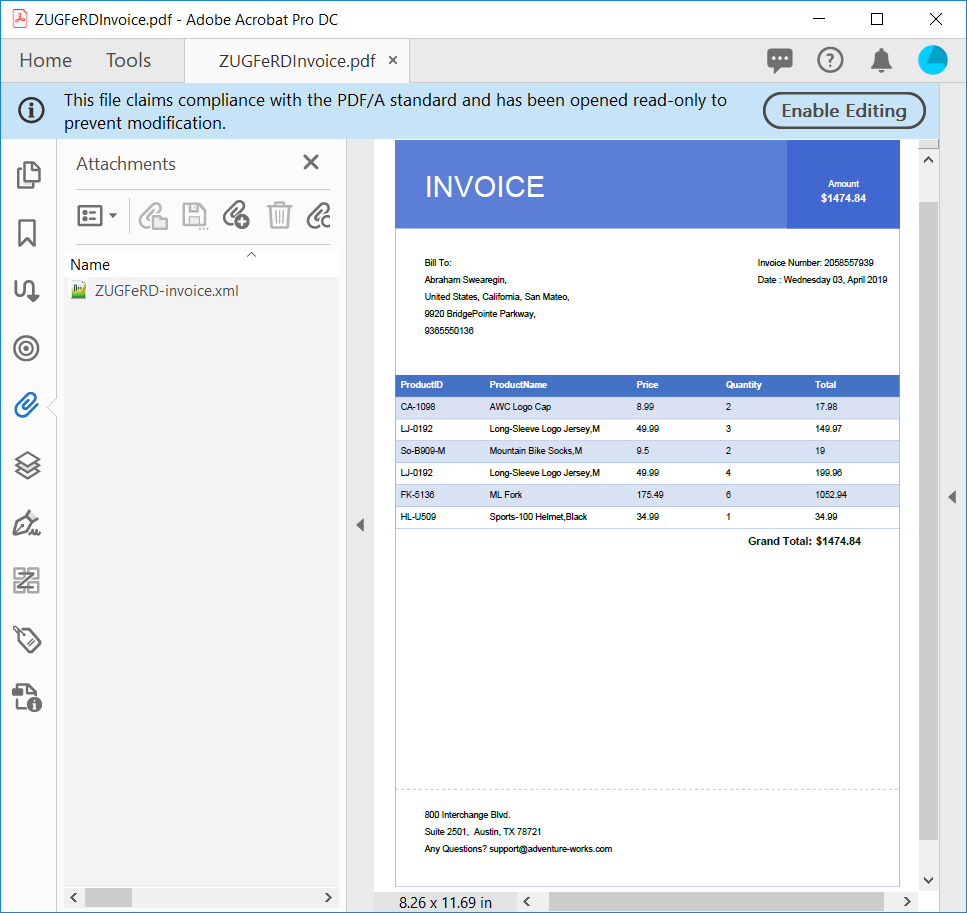
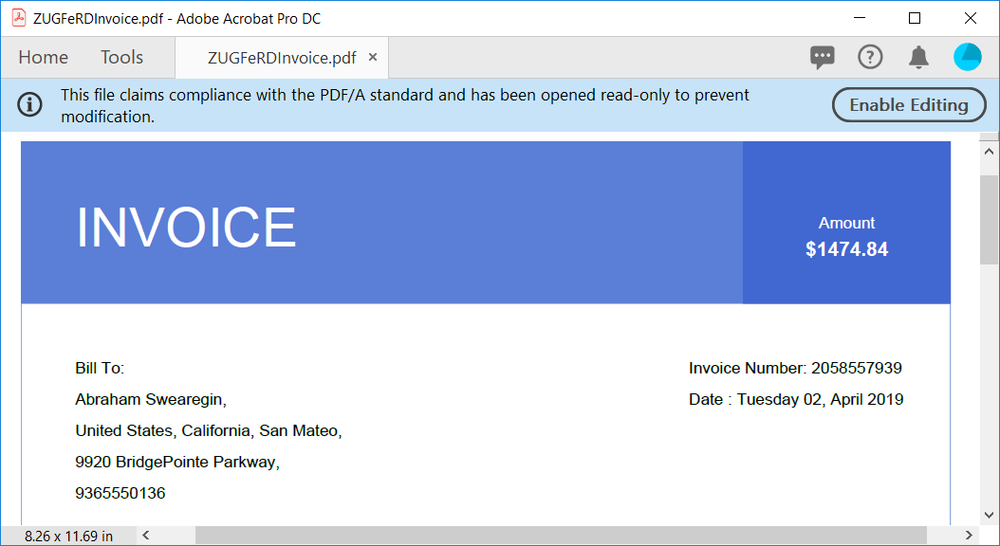
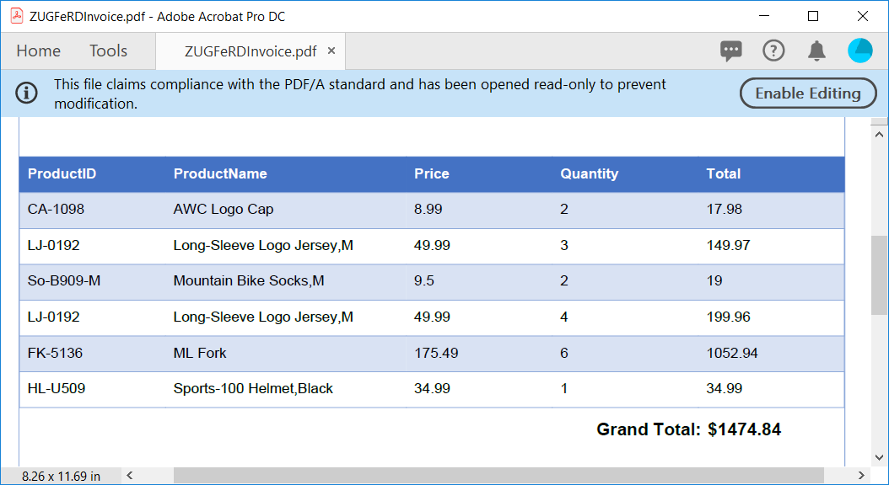
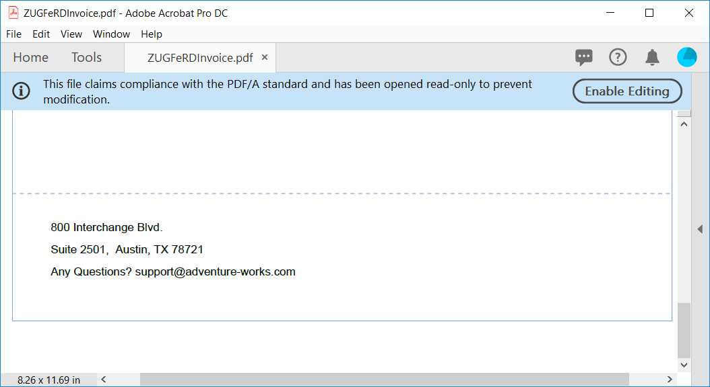

# Create ZUGFeRD-Compliant PDF Invoice in C#

The [Syncfusion PDF Library](https://www.syncfusion.com/document-processing/pdf-framework/net/pdf-library) now supports creating [ZUGFeRD](https://www.ferd-net.de/)-compliant PDF invoices in C#. ZUGFeRD (Zentraler User Guide des Forums Elektronische Rechnung Deutschland) is a German invoicing standard for the exchange of structured data in public and private sectors. A ZUGFeRD PDF is PDF/A-3 compliant and has an XML file attachment specifically designed for long-term archiving. Invoices made with ZUGFeRD PDF contain human-readable invoices with text, graphics, and images, as well as machine-readable structured invoice data in XML format.

This invoicing standard has multi-profile conformance:

* Basic: represents structured data for simple invoices, and you can include additional information as free text.
* Comfort: represents structured data for fully automated invoice processing.
* Extended: represents additional structured data for exchanging invoices across different industry segments.
In this article, let's create a basic ZUGFeRD invoice using C# like in the following screenshot.



## Creating a ZUGFeRD invoice

Create a PDF document with PDF/A-3b compliance and set the ZUGFeRD conformance level to basic.

```csharp
//Create PDF with PDF/A-3b conformance.
PdfDocument document = new PdfDocument(PdfConformanceLevel.Pdf_A3B);
//Set ZUGFeRD profile.
document.ZugferdConformanceLevel = ZugferdConformanceLevel.Basic;
```
Now create the fonts and brushes you want to use in the document. Declare values for margin, line space, and height to create a rich-looking ZUGFeRD PDF invoice.

```csharp
//Create border color.
PdfColor borderColor = new PdfColor(Color.FromArgb(255, 142, 170, 219));
PdfBrush lightBlueBrush = new PdfSolidBrush(new PdfColor(Color.FromArgb(255, 91, 126, 215)));

PdfBrush darkBlueBrush = new PdfSolidBrush(new PdfColor(Color.FromArgb(255, 65, 104, 209)));

PdfBrush whiteBrush = new PdfSolidBrush(new PdfColor(Color.FromArgb(255, 255, 255, 255)));
PdfPen borderPen = new PdfPen(borderColor, 1f);

//Create TrueType font.
PdfTrueTypeFont headerFont = new PdfTrueTypeFont(new Font("Arial", 30, System.Drawing.FontStyle.Regular), true);
PdfTrueTypeFont arialRegularFont = new PdfTrueTypeFont(new Font("Arial", 9, System.Drawing.FontStyle.Regular), true);
PdfTrueTypeFont arialBoldFont = new PdfTrueTypeFont(new Font("Arial", 11, System.Drawing.FontStyle.Bold), true);


const float margin = 30;
const float lineSpace = 7;
const float headerHeight = 90;
```

Here, most of the parameters (font size, margin, line space, and height) are adjusted based on a A4 page size.

It's obvious that we can tune these parameters in proportion to the size of the page, but this will slightly complicate the example.

## Adding a header and buyer information

Creating a PDF from scratch using Syncfusion PDF Library is easy and provides several ways to place elements in the document. In this example, we'll place the invoice title and buyer's information on the left, and the amount, invoice number, and date to the right.

The following code snippet is used to create the invoice header with basic information.


```csharp
//Add page to the PDF.
PdfPage page = document.Pages.Add();

PdfGraphics graphics = page.Graphics;

//Get the page width and height.
float pageWidth = page.GetClientSize().Width;
float pageHeight = page.GetClientSize().Height;
//Draw page border
graphics.DrawRectangle(borderPen, new RectangleF(0, 0, pageWidth, pageHeight));

//Fill the header with light Brush.
graphics.DrawRectangle(lightBlueBrush, new RectangleF(0, 0, pageWidth, headerHeight));

RectangleF headerAmountBounds = new RectangleF(400, 0, pageWidth - 400, headerHeight);           

graphics.DrawString("INVOICE", headerFont, whiteBrush, new PointF(margin, headerAmountBounds.Height / 3));

graphics.DrawRectangle(darkBlueBrush, headerAmountBounds);

graphics.DrawString("Amount", arialRegularFont, whiteBrush, headerAmountBounds, new PdfStringFormat(PdfTextAlignment.Center, PdfVerticalAlignment.Middle));

PdfTextElement textElement = new PdfTextElement("Invoice Number: 2058557939", arialRegularFont);
            
PdfLayoutResult layoutResult = textElement.Draw(page, new PointF(headerAmountBounds.X - margin, 120));

textElement.Text = "Date : " + DateTime.Now.ToString("dddd dd, MMMM yyyy");
textElement.Draw(page, new PointF(layoutResult.Bounds.X, layoutResult.Bounds.Bottom + lineSpace));

textElement.Text = "Bill To:";
layoutResult = textElement.Draw(page, new PointF(margin, 120));

textElement.Text = "Abraham Swearegin,";
layoutResult = textElement.Draw(page, new PointF(margin, layoutResult.Bounds.Bottom + lineSpace));
textElement.Text = "United States, California, San Mateo,";
layoutResult = textElement.Draw(page, new PointF(margin, layoutResult.Bounds.Bottom + lineSpace));
textElement.Text = "9920 BridgePointe Parkway,";
layoutResult = textElement.Draw(page, new PointF(margin, layoutResult.Bounds.Bottom + lineSpace));
textElement.Text = "9365550136";
layoutResult = textElement.Draw(page, new PointF(margin, layoutResult.Bounds.Bottom + lineSpace));
```


## Adding invoice data

Then, we add the invoice data from the database in a tabular format with five columns using [Syncfusion PDF tables](https://www.syncfusion.com/document-processing/pdf-framework/net/pdf-library/pdf-tables). We can use just a single line of code to apply table appearances, just like in Microsoft Word tables.

```csharp
PdfGrid grid = new PdfGrid();

grid.DataSource = GetProductReport();

grid.Columns[1].Width = 150;
grid.Style.Font = arialRegularFont;
grid.Style.CellPadding.All = 5;

grid.ApplyBuiltinStyle(PdfGridBuiltinStyle.ListTable4Accent5);

layoutResult = grid.Draw(page, new PointF(0, layoutResult.Bounds.Bottom + 40));

textElement.Text = "Grand Total: ";
textElement.Font = arialBoldFont;
layoutResult = textElement.Draw(page, new PointF(headerAmountBounds.X - 40, layoutResult.Bounds.Bottom + lineSpace));

float totalAmount = GetTotalAmount(grid);
textElement.Text = "$" + totalAmount.ToString();
layoutResult = textElement.Draw(page, new PointF(layoutResult.Bounds.Right + 4, layoutResult.Bounds.Y));

graphics.DrawString("$" + totalAmount.ToString(), arialBoldFont, whiteBrush, new RectangleF(400, lineSpace, pageWidth - 400, headerHeight + 15), new PdfStringFormat(PdfTextAlignment.Center, PdfVerticalAlignment.Middle));
```



## Adding seller information

Finally, we create the footer of the invoice with dashed lines and add the address of the seller. With this, we have successfully created a rich-looking PDF invoice from scratch using C#.

```csharp
borderPen.DashStyle = PdfDashStyle.Custom;
borderPen.DashPattern = new float[] { 3, 3 };

PdfLine line = new PdfLine(borderPen, new PointF(0, 0), new PointF(pageWidth, 0));
layoutResult = line.Draw(page, new PointF(0, pageHeight - 100));

textElement.Text = "800 Interchange Blvd.";
textElement.Font = arialRegularFont;
layoutResult = textElement.Draw(page, new PointF(margin, layoutResult.Bounds.Bottom + (lineSpace * 3)));
textElement.Text = "Suite 2501,  Austin, TX 78721";
layoutResult = textElement.Draw(page, new PointF(margin, layoutResult.Bounds.Bottom + lineSpace));
textElement.Text = "Any Questions? support@adventure-works.com";
layoutResult = textElement.Draw(page, new PointF(margin, layoutResult.Bounds.Bottom + lineSpace));
```



## Create ZUGFeRD XML

ZUGFeRD XML is based on [Cross Industry Invoice](https://tfig.unece.org/contents/cross-industry-invoice-cii.htm) (CII) developed by the United Nations Centre for Trade Facilitation and Electronic Business (UN/CEFACT). In this section, we will create a basic profile ZUGFeRD XML using [ZUGFeRD XML creation helper class](http://www.syncfusion.com/downloads/support/directtrac/general/ze/ZUGFeRDXMLHelper-1727879939) files. The following code snippet will create a ZUGFeRD XML using the helper class for the created invoice data.

```csharp
//Create ZUGFeRD Invoice.
ZugferdInvoice invoice = new ZugferdInvoice("2058557939", DateTime.Now, CurrencyCodes.USD);
//Set ZUGFeRD profile to basic
invoice.Profile = ZugferdProfile.Basic;
//Add buyer details.
invoice.Buyer = new UserDetails
{
    ID = "Abraham_12",
    Name = "Abraham Swearegin",
    ContactName = "Swearegin",
    City = "United States, California",
    Postcode = "9920",
    Country = CountryCodes.US,
    Street = "9920 BridgePointe Parkway"
};
//Add seller details
invoice.Seller = new UserDetails
{
    ID = "Adventure_123",
    Name = "AdventureWorks",
    ContactName = "Adventure support",
    City = "Austin,TX",
    Postcode = "78721",
    Country = CountryCodes.US,
    Street = "800 Interchange Blvd"
};
IEnumerable products = GetProductReport();

foreach (Product product in products)
    invoice.AddProduct(product);


invoice.TotalAmount = totalAmount;

MemoryStream zugferdXML = new MemoryStream();
invoice.Save(zugferdXML);
```

## Embed ZUGFeRD XML in PDF

After creating the ZUGFeRD XML, embed it within the PDF/A-3b document. As per ZUGFeRD guidelines, the embedded XML file name should be ZUGFeRD-invoice.xml. The relationship of the attachment and the document must be Alternative. In PDF/A-3b, this is expressed with the AFRelationship key.

```csharp
//Attach ZUGFeRD XML to PDF
PdfAttachment attachment = new PdfAttachment("ZUGFeRD-invoice.xml", zugferdXML);
attachment.Relationship = PdfAttachmentRelationship.Alternative;
attachment.ModificationDate = DateTime.Now;
attachment.Description = "ZUGFeRD-invoice";
attachment.MimeType = "application/xml";
document.Attachments.Add(attachment);
document.Save("ZUGFeRDInvoice.pdf");
document.Close(true);
```